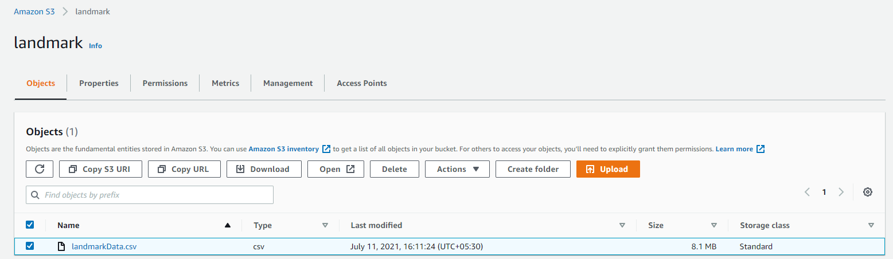
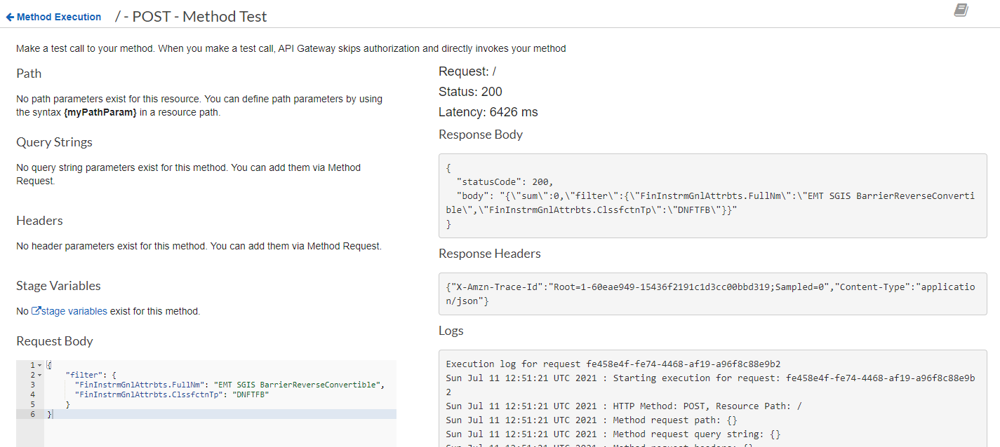
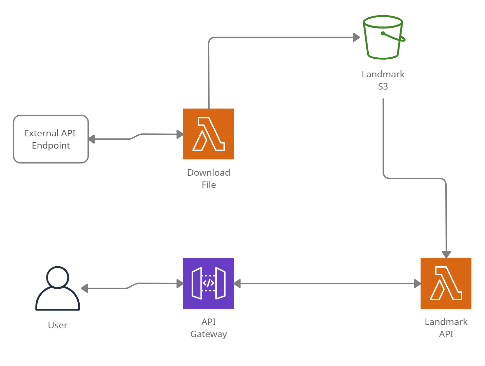

# Landmark Engineer Assessment Test


## Requirement

1. Download the xml from this link
1. From the xml, please parse through to the first download link whose file type is DLTINS and download the zip
1. Extract the xml from the zip.
1. Convert the contents of the xml into a CSV with the following header
    * FinInstrmGnlAttrbts.Id
    * FinInstrmGnlAttrbts.FullNm
    * FinInstrmGnlAttrbts.ClssfctnTp
    * FinInstrmGnlAttrbts.CmmdtyDerivInd
    * FinInstrmGnlAttrbts.NtnlCcy
    * Issr
    * TtlIssdNmnlAmt
1. Store the csv from step 4 in an AWS S3 bucket
1. The above function should be run as an AWS Lamba
1. Furnish an API with above data with below functionality –
    * add filter scope on field - FinInstrmGnlAttrbts.FullNm, FinInstrmGnlAttrbts.ClssfctnTp.
    * add aggregation scope (sum) on field: TtlIssdNmnlAmt
1. API can be based on some standard framework and utilize AWS lambda for execution

## Folders

1. API - Has the Lambda code that will make take a filter and process the filter and fetch the sum from an S3 bucket

2. DownloadFile - Has the Lambda code that will download and XML parse it fetch the download URL. Then will use the URL to download the file, unzip it, parse it, and upload it to S3 all using streams.


## Installation and Usage

1. Zip up the folders individually  
1. create 2 lambda functions upload the code as zip to each of them.
1. Create an S3 bucket
1. Execute DownloadFile lambda first. This will upload a file to the S3 file location.
 
1. create an API gateway that will hit the following API lambda that was created earlier.
1. Test out the lambda using the following format for the body.
``` 
{
    "filter": {
      "FinInstrmGnlAttrbts.FullNm": "EMT SGIS BarrierReverseConvertible",
      "FinInstrmGnlAttrbts.ClssfctnTp": "DNFTFB"
    }
}

```
 


## Overall Deployment 
 